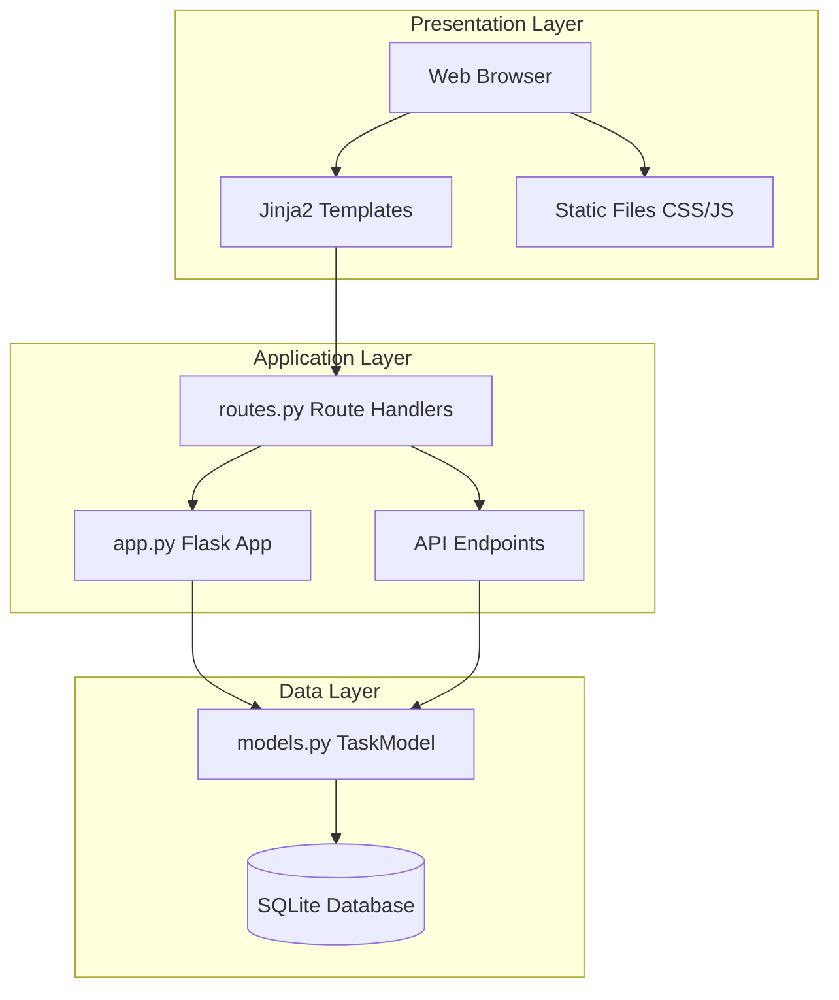
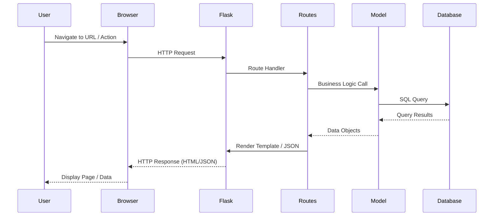
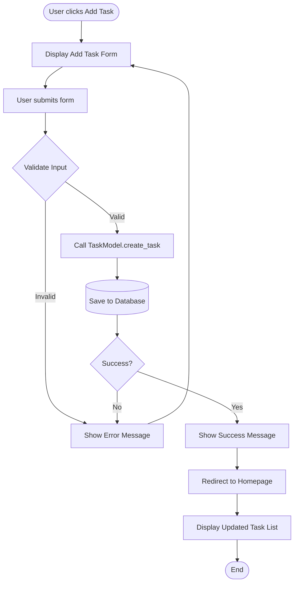
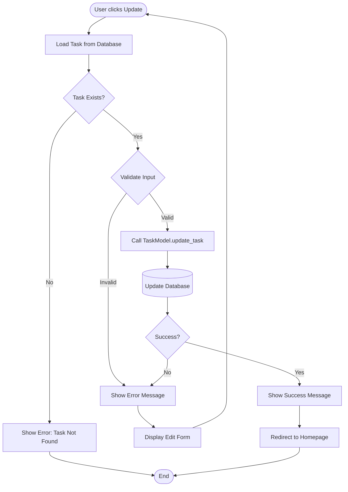
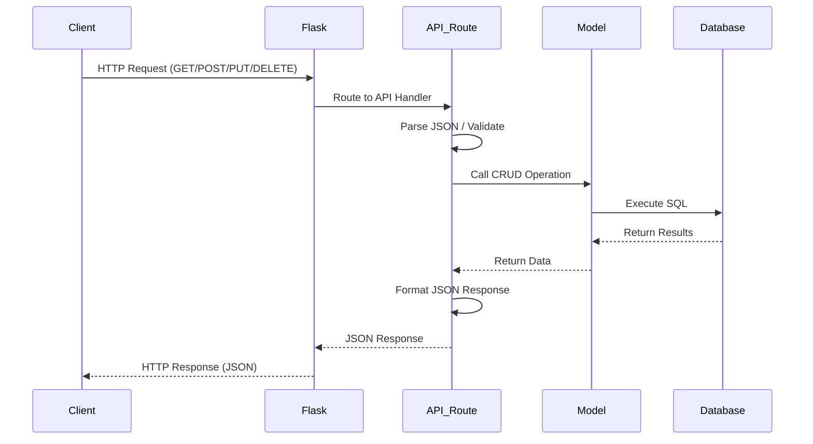

# Task Tracker: Architecture and Design Document

## 1. System Architecture

### 1.1 High-Level Architecture

The Task Tracker application follows a three-tier architecture pattern:

```
┌─────────────────────────────────────────────────────────────┐
│                      Presentation Layer                      │
│  (HTML/CSS/JavaScript, Bootstrap, Jinja2 Templates)        │
└───────────────────────┬─────────────────────────────────────┘
                        │
┌───────────────────────▼─────────────────────────────────────┐
│                    Application Layer                         │
│  (Flask Routes, Business Logic, Request Handling)           │
└───────────────────────┬─────────────────────────────────────┘
                        │
┌───────────────────────▼─────────────────────────────────────┐
│                      Data Layer                              │
│  (SQLite Database, TaskModel, CRUD Operations)              │
└─────────────────────────────────────────────────────────────┘
```

### 1.2 Component Architecture Diagram



### 1.3 Folder Structure and Organization

```
task-tracker/
├── Application Core
│   ├── app.py          # Flask initialization & configuration
│   ├── routes.py       # Route handlers (web + API)
│   └── models.py       # Database models & CRUD operations
│
├── Presentation
│   ├── templates/      # Jinja2 HTML templates
│   └── static/        # CSS, JavaScript, images
│
├── Data
│   └── database/      # SQLite database files
│
├── Deployment
│   ├── wsgi.py        # WSGI entry point
│   ├── gunicorn_config.py
│   └── scripts/       # Setup & deployment scripts
│
└── Configuration
    ├── requirements.txt
    ├── .env           # Environment variables
    └── .gitignore
```

## 2. Process Flow Diagrams

### 2.1 Request-Response Cycle



### 2.2 Task Creation Flow



### 2.3 Task Update Flow



### 2.4 API Request Flow



## 3. Database Schema Design

### 3.1 Entity Relationship

```
┌─────────────────────┐
│       Tasks         │
├─────────────────────┤
│ id (PK)             │
│ title (NOT NULL)    │
│ description         │
│ status (NOT NULL)   │
│ created_at          │
│ updated_at          │
└─────────────────────┘
```

### 3.2 Table Structure

**Table: tasks**

| Column      | Type      | Constraints           | Description                    |
|-------------|-----------|-----------------------|--------------------------------|
| id          | INTEGER   | PRIMARY KEY, AUTOINCREMENT | Unique task identifier    |
| title       | TEXT      | NOT NULL              | Task title (max 200 chars)     |
| description | TEXT      | NULL                  | Task description (max 1000)    |
| status      | TEXT      | NOT NULL, DEFAULT 'incomplete' | Task status            |
| created_at  | TIMESTAMP | DEFAULT CURRENT_TIMESTAMP | Creation timestamp      |
| updated_at  | TIMESTAMP | DEFAULT CURRENT_TIMESTAMP | Last update timestamp   |

### 3.3 Indexes

- Primary key index on `id` (automatic)
- Consider adding index on `status` for filtering performance (future enhancement)

## 4. Design Rationale

### 4.1 Choice of Data Storage Mechanism

**Decision**: SQLite Database

**Rationale**:
1. **Relational Data Management**: SQLite provides ACID compliance and relational data integrity
2. **Zero Configuration**: No separate server process required, making deployment simpler
3. **File-based Storage**: Database stored as a single file, easy to backup and migrate
4. **Performance**: Excellent for small to medium-sized applications
5. **Python Integration**: Built-in support via `sqlite3` module, no additional dependencies
6. **Scalability**: Sufficient for the project requirements (single-user to small team)

**Alternatives Considered**:
- **JSON File Storage**: Simpler but lacks transaction support and query capabilities
- **In-memory Dictionary**: Fastest but no persistence, data lost on restart

### 4.2 Application Structure and Modularization

**Decision**: Separate files for models, routes, and templates

**Rationale**:
1. **Separation of Concerns**: Each module has a single responsibility
   - `models.py`: Data access layer
   - `routes.py`: Request handling and business logic
   - `app.py`: Application configuration and initialization
2. **Maintainability**: Easy to locate and modify specific functionality
3. **Testability**: Components can be tested independently
4. **Scalability**: Easy to add new features without cluttering existing code
5. **Code Reusability**: Models can be reused across different routes

**Structure Benefits**:
- Clear organization following Flask best practices
- Easy navigation for developers
- Supports future expansion (e.g., adding authentication, additional models)

### 4.3 Template and Static File Organization

**Decision**: Jinja2 templates with Bootstrap framework

**Rationale**:
1. **Template Inheritance**: Base template reduces code duplication
2. **Dynamic Content**: Jinja2 provides powerful templating features
3. **Bootstrap Framework**: 
   - Pre-built responsive components
   - Consistent UI/UX
   - Mobile-first design
   - Reduced development time
4. **Static File Organization**: Separate folders for CSS and JS enable better caching and organization

**Template Hierarchy**:
```
base.html (navigation, footer, common elements)
  ├── index.html (homepage)
  ├── add_task.html (add form)
  └── edit_task.html (edit form)
```

### 4.4 Security Considerations

**Implemented Security Measures**:

1. **SQL Injection Prevention**:
   - Use parameterized queries (prepared statements)
   - Never concatenate user input into SQL queries
   - Example: `cursor.execute("SELECT * FROM tasks WHERE id = ?", (task_id,))`

2. **Input Validation**:
   - Server-side validation for all user inputs
   - Length limits on title (200 chars) and description (1000 chars)
   - Required field validation
   - Client-side validation for better UX

3. **XSS Prevention**:
   - Jinja2 auto-escapes template variables by default
   - User input is properly sanitized before rendering

4. **CSRF Protection**:
   - Flask-WTF can be added for production (future enhancement)
   - Currently using POST for state-changing operations

5. **Error Handling**:
   - Try-catch blocks prevent information leakage
   - Generic error messages for users
   - Detailed errors logged server-side

6. **Environment Variables**:
   - Sensitive configuration (SECRET_KEY) stored in `.env`
   - `.env` file excluded from version control

### 4.5 API Design Rationale

**Decision**: RESTful API with JSON responses

**Rationale**:
1. **Standard Protocol**: REST follows HTTP conventions (GET, POST, PUT, DELETE)
2. **JSON Format**: Lightweight, human-readable, widely supported
3. **Stateless**: Each request contains all necessary information
4. **Resource-based URLs**: Clear and intuitive endpoint structure
5. **Error Handling**: Consistent error response format
6. **Future Integration**: Easy to integrate with mobile apps or other services

**API Response Format**:
```json
{
  "success": true/false,
  "data": {...},
  "error": "error message" (if success is false)
}
```

### 4.6 Deployment Strategy

**Decision**: Gunicorn WSGI server with configuration file

**Rationale**:
1. **Production Ready**: Gunicorn is a robust, production-grade WSGI server
2. **Performance**: Handles multiple concurrent requests efficiently
3. **Configuration**: Separate config file allows easy tuning
4. **Process Management**: Can be managed with systemd or supervisor
5. **Scalability**: Supports multiple worker processes

**Deployment Scripts**:
- `setup.sh`: Automated environment setup
- `deploy.sh`: One-command deployment
- Reduces manual errors and setup time

## 5. Data Flow Summary

### 5.1 Web Request Flow

1. **User Action** → Browser sends HTTP request
2. **Flask Router** → Matches URL to route handler
3. **Route Handler** → Validates input, calls business logic
4. **TaskModel** → Executes database operations
5. **SQLite** → Returns query results
6. **Template Rendering** → Jinja2 renders HTML with data
7. **Response** → Browser displays rendered page

### 5.2 API Request Flow

1. **Client Request** → HTTP request with JSON payload
2. **Flask Router** → Routes to API endpoint
3. **API Handler** → Parses JSON, validates data
4. **TaskModel** → Performs CRUD operation
5. **SQLite** → Executes query and returns data
6. **JSON Response** → Formatted JSON returned to client

## 6. Performance Considerations

1. **Database Queries**: Use parameterized queries for efficiency
2. **Connection Management**: Database connections opened/closed per request
3. **Caching**: Static files served efficiently by Flask
4. **Worker Processes**: Gunicorn configured with optimal worker count
5. **Future Enhancements**: Database indexes, connection pooling, query optimization

## 7. Scalability Considerations

**Current Limitations**:
- Single SQLite database file
- No user authentication (single-user system)
- No horizontal scaling support

**Future Scalability Options**:
- Migrate to PostgreSQL for multi-user support
- Add Redis for session management and caching
- Implement load balancing for multiple server instances
- Add database connection pooling
- Implement task queuing for background jobs

---

**Document Version**: 1.0  
**Last Updated**: 2024  
**Author**: Task Tracker Development Team

